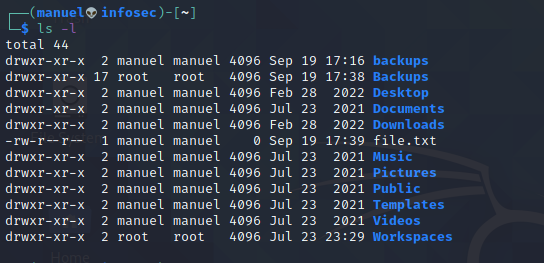
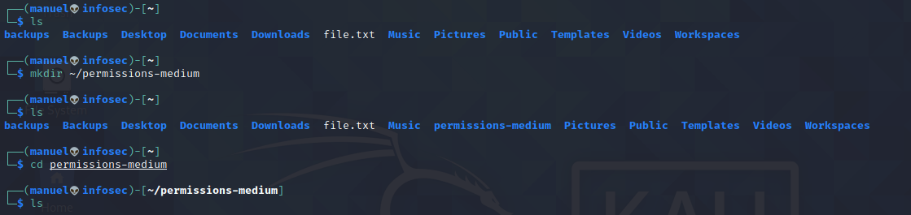
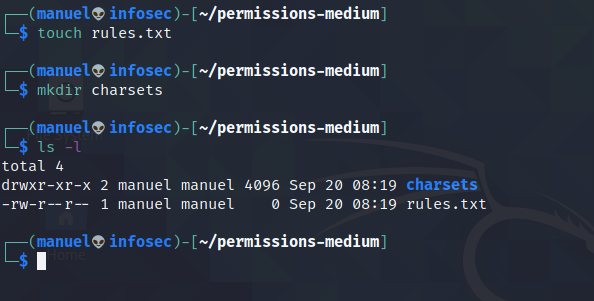
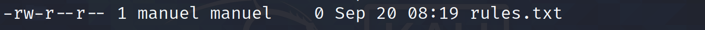
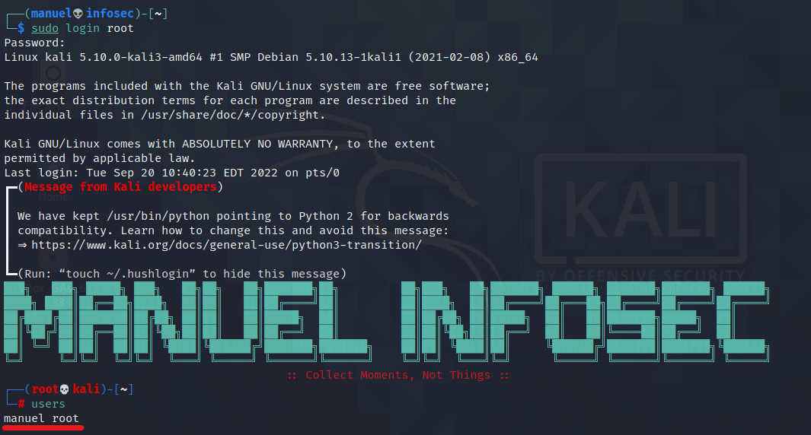
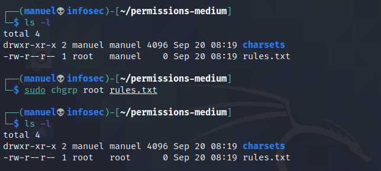
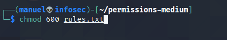
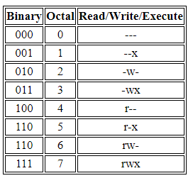
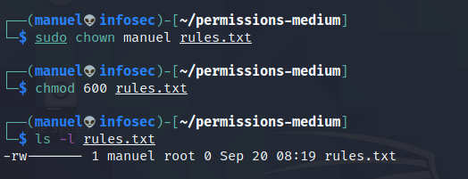

# Linux File And Directory Permissions
## System Administration Made Easy

From smartphones to cars, supercomputers. home appliances, desktops, and enterprise servers, the Linux operating system is everywhere. On all of these systems, security should definitely be considered a priority. 


<p align="center"><sub>Photo Credits: <a href="https://blog.resellerspanel.com/virtual-private-servers/secure-linux-vps-practical-tips.html">Resellers Panel Blog</a></sub></p>

Like any professional or enterprise-level operating system, Linux has methods for securing file and directory access. This allows the owner or system administrator — the root user — protect files from unwanted access by granting permissions to selected users. These permissions can include read, write or execute access.

If you're not new to the Linux operating system, you should have across a similar listing to the image below:



In this article, we’ll uncover the science behind Linux permissions, including checking, granting and changing permissions. Lastly, we’ll discuss the Linux decimal notation and UGO syntax. If you’ll ever work with a Linux operating system in your lifetime, this article is for you.

If you've not, drop a follow on any of my various social handles to get notified when I make new article alerts:
-   [Twitter](https://twitter.com/manuelinfosec),
-   [Facebook](http://facebook.com/manuelinfosec),

For a little heads up, the command `ls -l` in the image above, was used to list files and directories with their respective permission details.

### Linux Users And Groups
As you know (or if you don't know). the root user, is the most powerful user in the Linux OS. It is the user account for administrative purposes, and typically has the highest access right on the system. Usually, the root user is called **root**. Other users have more limited capabilities and permissions compared to the root user.

A group on the Linux system is a collection of users. For example, in an IT environment, these groups might include developers, designers, administrators. The primary purpose of the groups is to define a set of permissions for a given file or directory that inherited by the users within the group. This eases Linux administration, permissions, thus, security.

By default, the root user is part of the root group. Each new user on the system must be added to a group to inherit the permissions of that group.

### Checking Permissions
When you want to find out what permissions are granted for a file or directory use the `ls` command with the `-l` (long) switch to display the contents of a directory in long format -- the list will contain the permissions. If you'll be following along, load up a Linux terminal. If you're not around a Linux computer, you could settle for the an android shell emulator, Termux is a great choice.

For the sake of illustration and organization, we'll create a folder to hold all the files and directories for this exercise. Create a folder in your home directory with a name of your choice. I'd prefer `permissions-medium` as a suitable name. The command below creates a folder names `permissions-medium` in the home directory.

```bash
mkdir ~/permissions-medium/
```



Lots of detail in the image above, but the most notable is that, there was no directory named `permissions-medium` before it was created. Lastly, I changed to the newly-created directory **(You should do that too)**. In the same folder, create a file and folder named `rules.txt` and `charsets` and list it in long format:

```bash
touch rules.txt
mkdir charsets
ls -l
```

It should look something like this:



On each line we get information about:
- the file type,
- the file permissions for owner, groups, and other users,
- the number of hard links (this topic is beyond the scope of this article),
- the owner of the file,
- the size of the file in bytes,
- time of last modification,
- file or directory name.

This section will focus on the cryptic strings of letters and dashes on the left edge of each line. As earlier said, it indicates a file or directory and its permissions.

The first character indicates the file type, where `d` stands for a folder/directory and a dash (`-`) indicates a file. 

The next section define the files' permissions. There are three sets of characters, made of some combination of read (`r`), write (`w`) and execute (`x`). The first set represents the permissions of the owner; the second. those of the same group with the owner; and the last, those of all other users.

To put it into more perspective, if you see an `r` first in any of the three sets, that user or group or users has permissions to open and read that file or directory. A `w` as the middle letter indicates they can write (or modify) the file or directory, and `x` at the end means they can execute (or run) the file or directory. In any of the three sets, if `r`, `w` or `x` is replaced with a dash (`-`), then that respective permission hasn't been granted.

Let's use the second line of output in the image above as an example:



From the right end of the line, this file is called rules.txt. After the first dash (`-`), which indicates it's a file, the permissions `rw-` indicates that the owner has read and write permissions but no permission to execute the file (if it was a script or binary).

The next set of permissions `r--` represents those of the group and shows that the group has read permission but no write or execute permissions. That means, another user in the same group with the user, `manuel`, cannot edit the file. From the last set (`r--`), other users can read but not write nor execute the file.

These permissions aren't set in stone. As a root user or file owner, you can change them. In the coming sections, we'll do just that.

### Granting Permissions
It's no longer news that every file and directory in the Linux filesystem must be allocated a particular level of permission for the different entities using it.

The root user can grant users a level of permission depending on what they need the files for. When a file is created, typically the user who created it is the owner of the file, and the owning group is the user's current group. The owner can also grant access privileges to the file. In this section, we'll look at how to change permissions to pass ownership to individual users and groups.

**Granting Permissions to a User**
Changing ownership of a file to a different user is pretty easy. You just have to use the `chown` (change owner) command:

```bash
chown <new_owner> <path_to_file>
```

If you're not the root user, you may have to attach the `sudo` prefix:
```bash
sudo chown <new_owner> <path_to_file>
```

In the illustration below, I changed the file owner from `manuel` to `root`.

![[Pasted image 20220920151945.png]]

The file owner field changes from `manuel` to `root`.  Pretty self-exp

Note: This doesn't mean that the root user didn't have owner privileges before the change of ownership.

It's also worth noting that the command `users` used on the superuser account lists all the users on the system:
```bash
# on the root account
users
```

Output, on my machine:



**Granting Ownership to a Group**
At the same time, changing ownership of file from one group to, the `chgrp` (change group) command. Let's change the group owner of `rules.txt`.

```bash
sudo chgrp root rules.txt
```



Same can be as well applied to the directory. Test yourself a little by changing the owner and group owner of the `charsets` directory. Share your results in the comments, below.

In the last two sections, you checked the permissions and owner of files. Let's play with permissions in the next sections.

### Changing Permissions
We can use the Linux command `chmod` (change mode) to change the permissions. Only a root user or the file's owner can change permissions.

In this section, you'll learn how to change permissions using two different method. First, is the numerical representation of permissions, and symbolic representation.

**Changing Permissions with Decimal Notation**



We can represent permissions by using a single number to represent one `rwx` set or permissions. This time, permissions will be represented in binary, so ON and OFF switches are represented by 1 and 0, 
 respectively. You can think of the `rwx` permission as three ON/OFF switches. When all permissions are granted it equated to **111**.

If you ask me, I'd say there should be a better way of representing these binary digits. Fortunately, there is. 

With the octal (0 - 7) numbers system, the range of binary numbers, 000 to 111, can be well represented, meaning we can represent an entire `rwx` set with one digit. The table below contains all possible permission combinations and their binary/octal representatives.



Using the information, let's go through some examples. To set read permissions, consult the table above:

```
r w x
4 - -
```

Let's add the permissions for write and execute, using the same methodology:

```
r w x
- 2 1
```

Notice how the octal representation for `-wx` is also 3? This is logical because 2+1=3.

When we add all three permissions, it should look like this:

```
r w x
4 2 1
```

Same way, 4+2+1= 7. It is now clear that when all the switches are on, they are represented by the octal equivalent of 7. But this is just for the owner. 

To represent all permissions for owner, group and all users, it will be written as follows:

```
r w x
7 7 7
```

Let's go back to the image above that has the `chmod 600 ...` command, the resulting permissions should be:

```
Owner Group Others
  6     0     0
 rw-   ---   ---
```

In brief, 600 equates to `rw-------`. Let's confirm from the terminal.



As expected! Same method can be applied to directories too. I used the first command to set `manuel` as owner of the file from `root`. Try giving maximum permissions to owner, group and other users (this is unsafe for important files).

**Changing Permissions with UGO syntax**
The numeric method is probable the most common method for changing permissions in Linux, some find the symbolic method to be simpler.

The UGO syntax is very simple. All you got to do is, enter the `chmod` command you want to change permissions for, providing `u` for user, `g` for group, or `o` for others, followed by one of one of the three operators:

`-` (dash): Removes a permission.
`+` (plus): Adds a permission.
`=` (equal): Sets a permission.

After the operator, include the permission you want to add or remove (`rwx`), and finally, the name of the file to apply the permission to. 

For example, the line below removes all permissions.

```bash
chmod u=--- rules.txt
```

The command below sets maximum permission for owner:

```bash
chmod u=rwx rules.txt
```

Find more below:


You can change permissions for group and other users by replacing `u` with `g` or `o`, as required.

It's worth noting that both the numeric and symbolic method works well. It's up to you to choose which works best for you. Tell me your preference in the comments.

### Conclusions
Linux is one of the most secure systems, because it ensures efficient authorization, meaning users see only what they are required to see and nothing more. The idea of permissions applied to users, groups and other users has been made really easy on the Linux system with this article, unlike Windows. And now you know exactly how to do it! 🚀

*Signing out,*<br>
Manuel.